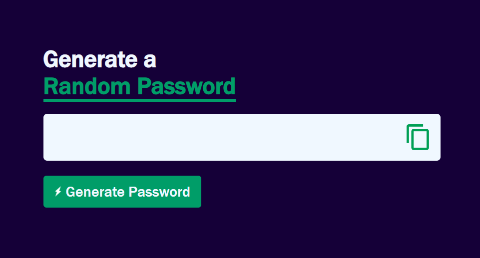
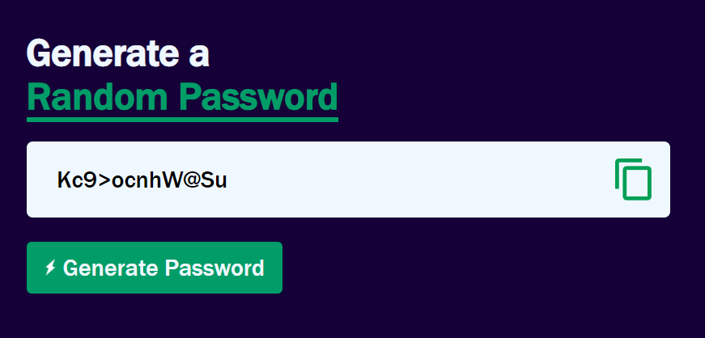

# Random-Password-Generator
>This will generate a Random password for you, that you can copy and use anywhere.

 

## Technology Used:
* JavaScript
* HTML
* CSS

## Features:
* It will generate random password of length of 12 characters.
* This password will contain uppercase letters(A-Z), lowercase letters(a-z), numbers(0-9) & symbols.
* On clicking "Generate Password" button, you will get unique password each time.
* You can copy password by clicking on "Copy Icon".
